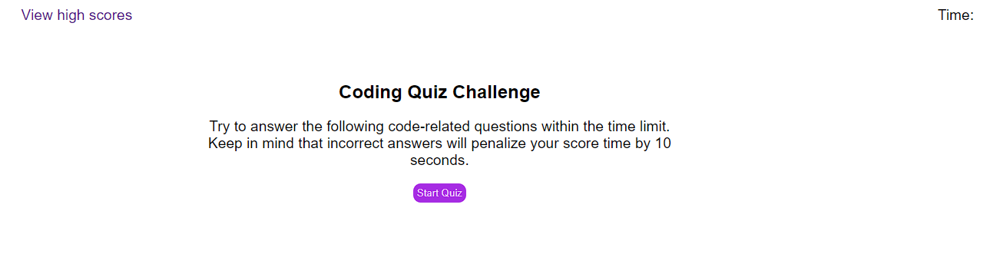

# CodeQuiz

## Link to the deployed application
https://kbjss071.github.io/CodeQuiz/

## To-do Lists
- When the start button is clicked, a timer starts and question should be presented.
- When the question is answered, the webpage should move to the next question.
- When the question is answered incorrectly, time is subtracted from the clock.
- When all questions are answered or the timer reaches 0, the game is over.
- When the game is over, the browser prompts user to save their initials and score.

## Words done for the project
### In Index.html
 - Created a list of questions
 - Created buttons for `StartQuiz` and `SelectAnswer`. When user clicks one of those buttons, the button is designed to perform in appropriate way.
 - Created a link to `highestScore.html`. The link is always on top-left corner of the page and when it is clicked the page loads the score page.
 - Created a form to submit user's inital and time score in thier quiz.
 -  Time Function: 
    - Remaining time is displayed on top-right corner.
    - The time is dropped by 1 every second and when user chooses a wrong answer, user is penalized by reducing time by 15 seconds.
    - When the time remaining hits 0 or less, the page loads a form to submit their initial and store their data.

### In highestScore.html
 - Stored data is displayed on the page
 - When user clicks the clear history button, it functions to remove score list on the page and data in local storage.
 - When user clicks `goBack` button, the page loads the first page of the quiz.